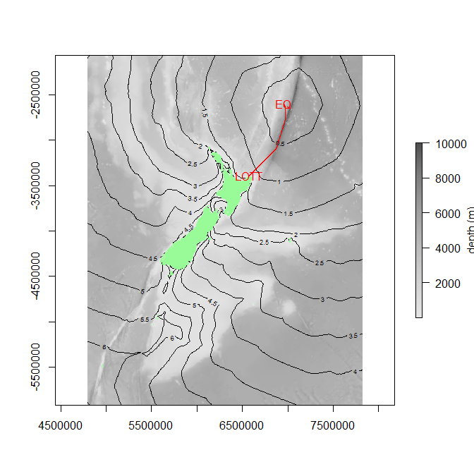

# GIS Experiments (Python)

I decided to have a play with GIS and Python (27/05/2021 and R! Sorry!). This is a record of where I got and didn't get.

No real end goal, but maybe useful to someone. **Come along for the ride**!

Prior to this I had tried using Anaconda (C/C++ binaries are all packaged up) for GIS stuff but just didn't get on with it. So, experiments below are based on 'vanilla' `pip` python3.8 running on Windows10 (64 bit).

This does mean I had to find `whl` files that included binaries for some libraries, but I found this in a funny way 'easier' that Anaconda.

On linux? Easy for you, I think.

## Installing from local WHl file

So, GDAL, Rasterio, Fiona and RTree install using the `*.whl` files included (rather than from pypi). Installing from whl files includes the required compiled C/C++ binaries. If you install this libraries from pypi, it will not come with binaries and you will sink in error messages.

I have included the `whl` files. If not using Python 3.8x (eg 3.9) then your will need to d/l appropriate whl files (or just setup a 3.8 venv). I got the files here.

### Installation of whl files:

```bash
pip install GDAL-3.2.2-cp38-cp38-win_amd64.whl
pip install rasterio-1.2.3-cp38-cp38-win_amd64.whl
...etc
```

## Source data

I live in Auckland, NZ so I am using data relevant to here. Am sure you can get equivalent data for other places. Below is the running list of data sources.

### Raster

- 0.5m resolution aerial images of Auckland. Download from [here](https://data.linz.govt.nz/layer/51769-auckland-05m-rural-aerial-photos-2010-2012/), selecting JPEG format. Download is fairly large (12 gig!) so takes a while. Unzip into `data/aerial/`
- 250m resolution bathymetic data for [experiment 7](#expt-7-tsunami).

### Vector files

- KML files: I made these myself in Google MyMaps
- LINZ website for NZ vector files
- geofabrik.de for OpenStreetMap SHP files

# The Experiments

## Expt 1: Mosaic

```bash
python expt1_create_mosaic.py
```

Merge/ mosaic all the tiles from sample into single GeoJPEG of managable size, maintaining all GIS meta data of original.

Downsamples from 0.5m res to 2m and merges. Creates ~12MB file.

Note that trying to merge original files without downsample will invariably cause you the following error:

> numpy.core._exceptions.MemoryError: Unable to allocate 250. GiB for an array with shape (3, 345600, 259200) and data type uint8

Files are RGB (3 channels of 256 levels) and merges area's extend is ~173km x130km (345600 x 259200 @ 0.5,0.5m res). A `uint8` is 1 byte:

```bash
[3 x (45600 x 259200) ] x 1 byte = 268.7 gigabytes
```

5/5/21 Update: Previous broke coords. now corrected and seems to work ok.

## Expt 2: KML import

Imports KML files I exported from my Google MyMaps to Geopandas dataframes and merges adjacent polygons.  I checked the KML export in MyMaps, it defaults to KMZ otherwise which works just as well, just KML Is just a textfile so more easily readable & debuggable.

A couple of Python installs/imports. `fiona` from whl included as per previous:

```
pip install shapely, geopandas,pyshp
pip install Fiona-1.8.19-cp38-cp38-win_amd64.whl
```

Then,

```bash
python runme_kml_import.py
```

Few issues with the KML importer I found [here](https://gist.github.com/linwoodc3/0306734dfe17076dfd34e09660c198c0`):

- Works on the principal that each `<Placemark>`   `<name>`is unique. Names are not unique in the KMLs I exported from MyMaps which result in polygons going missing. I cleaned up by hands in the KML files (renaming duplicates). Could fix in code, someday.
- Importers does not recognise KML `<Folders>` which are how MyMaps 'layers' are distinguished in exported KML.s I exported each layer into separate KML.

## Expt 3: Coordinate systems

```bash
python expt3_kml_crs
```

Imported KML (from Google MyMaps) does not have a coordinate system included in file, turns out its WSG84 (EPSG:4326). Aerial data from aerial photo is NZ Transverse Mercator 2000(NZTM, NZGD2000, EPSG:2193).

This experiment just assigns correct crs to imported kml data & transforms to NZTM.

## Expt 4: KML rastermask

```bash
python expt3_kml_rastermask
```

Creates a rastermask from kml vector geometry and applies to aerial mosaic. Masked areas are assigned 'no data' (or something like that)

## Expt 5: Figure ground experiments

Bit of a change a tack: now using Jupyter notebooks to run files inline (in VS Code).
This experiment uses buildind outline data from LINZ, exported a SHP file from [website](https://data.linz.govt.nz/layer/101290-nz-building-outlines/). Set bound box on very small area for export since kills computer otherwise.

I am learning that all GIS seems to kill my computer - too much data.

## Expt 6: OpenStreetMaps export clipping

Found [this website](http://download.geofabrik.de) where you can download snapshots of OpenStreetMaps as SHP file. I using [this one for New Zealand](http://download.geofabrik.de/australia-oceania/new-zealand-latest-free.shp.zip) unzipped into `data/osm/'. I tried to open unedited in GRASS GIS, QGIS and AutoCAD Maps. Computer spat the dummy for all three.

This experiment clips the files to a more manageable size and area using the mask created in expt4

Needs `rtree` for the clipping operation

```bash
pip install Rtree-0.9.7-cp38-cp38-win_amd64.whl
```

## Expt 7: Tsunami

**🌊 A real sidestep into the bizarre world of R**

In NZ - February 2021 - we had some tsunami warnings from offshore quakes. No ill-effects from quakes as far as I know, and afterwards I got to thinking about the travel time and speeds of tsunamis.

First attempt just took the great circle line between event and point of interest, pinged Google Maps Elevations API for depths along this path and then applyed this equation, `c = sqrt(g.d) ~ 3.13 x sqrt(d) `, for the approximate speed of the wave.

Event info was retrieved from USGS Api. Anyway, the predicted arrival time was a fair way off the actual arrival times (measured at wave buoys off NZ coast) so I scrapped this approach.

One issue (I thought) was the as-the-crow path is unlikely to be the fastest path since waves will travel faster in deep water. Computationally this least-cost route problem is a bit more challenging.

To cut a long story short, this was my first foray into GIS, prior to these experiments and I did not get very far (mainly getting my Windows machine to play with various Python GIS-related libraries).

Having since kind of worked out Python issues (hence these experiments) by using precompiled whl files, I thought i might tackle my tsunami problem again.

Unfortunately not, not using Python-on-Windows anyway. I have 'solved it' in R though and consequently code for experiment 7 is all in R (and subsequently massively bizarre!).

1. Data from here.

   - Bathymetry data from [here](https://niwa.co.nz/static/bathymetry/NZBathy_DTM_2016_ascii_grid.zip) as an ESRI ASCII grid and converted to GeoTIFF in [QGIS](https://qgis.org/en/site/) - this made a file of ~700MB with 10000 levels (10000m deep!) with a 250m x 250m resolution.
   - Event data from [here](https://earthquake.usgs.gov/earthquakes/map).
2. The R scripts. Surprisingly succinct, but not for the faint-hearted. Might as well be double-Dutch. Notes in file:

   * `expt7a_prep_conductance_frm_bathy.R` This prepares the conductance transition layer from the bathmetric data and saves to `data/out/conductance.rds`. This step takes a while but once done is done, hence the *save to file*.
   * `expt7b_shortest_bathy_pth.R`. Reloads the data (could hash this out if in memory already) and solves the rest of the problem for an event at location A (defined using event code from USGC) and point of interest B (defined as latlng). Needless to say, both event and POI need to be within bounds of map!

   One could do a lot more with this (starting with checking its accuracy, for instance!). Perhaps next time there is a tsunami warning?🌊The equation quoted above, I believe, models a *non-dispersive linear wave* but other models will be more applicable in other scenarios, for instance when the tsunami begins to shoal in shallower water near the coast ([ref here](/img/hammack1978.pdf))

### Output

Image below is est 'first wave' path tracked from [the May2020 Kermadec M8.1 quake](https://earthquake.usgs.gov/earthquakes/eventpage/us7000dflf/executive) to [Lottin point wave buoy] (https://www.researchgate.net/figure/Locations-of-sea-level-gauge-stations-around-New-Zealand-and-other-locations-mentioned-in_fig1_256422330).

Contours are hours.


